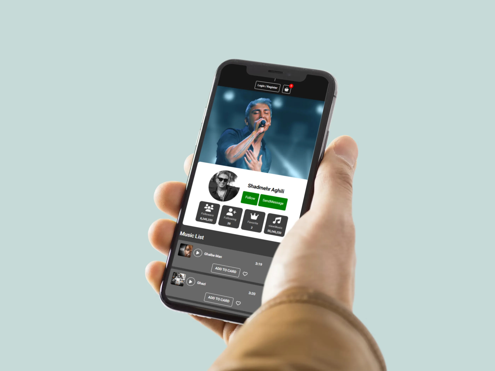

[EN]

# 🎵 Lionify

A modern front-end music platform concept built for portfolio purposes.

Lionify is an educational front-end project inspired by modern music streaming platforms. It allows users to browse artists, explore their music collections, play songs, and manage their personal favorites and shopping cart.

> ⚠️ This project is for educational and portfolio purposes only. It is not intended for commercial use.

---

## 🌐 Live Demo

🔗 https://YOUR-DEMO-LINK.com

---

## 📸 Preview

### Desktop

### Mobile

# ✨ Features

- 🎵 Artist dedicated pages
- 🎧 Play local music files
- ❤️ Add or remove songs from Favorites
- 🛒 Add or remove songs from Shopping Cart
- 💾 Favorites & Cart saved using LocalStorage
- 👥 Artist statistics (Followers, Views, Songs...)
- 🎠 Swiper.js slider for artist navigation
- 📱 Fully Responsive Design
- 🎨 Modern UI
- ⚡ Fast front-end performance

---

# 🛠 Built With

- HTML5
- CSS3
- JavaScript
- Bootstrap
- Font Awesome
- Swiper.js
- LocalStorage API

---

# 👨‍🎤 Artists Included

### 🇮🇷 Iranian Artists

- Amir Tataloo
- Shadmehr
- Shayea

### 🌍 International Artist

- Taylor Swift

> All audio files are stored locally inside the project.

---

# 📁 Project Purpose

The purpose of this project is to improve front-end development skills and demonstrate the implementation of interactive user interfaces using JavaScript.

This project focuses entirely on front-end development and does not include any backend services or APIs.

---

# 📌 Notes

- Portfolio / Educational Project
- Front-end only
- No authentication
- No payment system
- No backend
- Local data storage only

---

## 🎯 Learning Objectives

- DOM Manipulation
- Responsive Design
- Component-based UI Thinking
- State Management using LocalStorage
- Clean Folder Structure

---

## 🚀 Future Improvements

- Backend Integration
- User Authentication
- Music API
- Search System
- Playlist Management
- Dark / Light Theme

---

# 👨‍💻 Author

Developed with ❤️ by Alireza MansoryFard

[DE]

# 🎵 Lionify

Ein modernes Frontend-Musikplattform-Konzept, das zu Portfolio- und Lernzwecken entwickelt wurde.

Lionify ist ein Frontend-Projekt, das von modernen Musik-Streaming-Plattformen inspiriert wurde. Benutzer können Künstler entdecken, deren Musik anhören sowie Lieblingssongs und Warenkorb verwalten.

> ⚠️ Dieses Projekt dient ausschließlich Lern- und Portfoliozwecken.

---

## 🌐 Live Demo

🔗 https://YOUR-DEMO-LINK.com

---

## 📸 Vorschau

### Desktop

### Mobile

---

# ✨ Funktionen

- 🎵 Eigene Seiten für jeden Künstler
- 🎧 Lokale Musikwiedergabe
- ❤️ Songs zu Favoriten hinzufügen oder entfernen
- 🛒 Songs zum Warenkorb hinzufügen oder entfernen
- 💾 Speicherung mit LocalStorage
- 👥 Künstlerstatistiken anzeigen
- 🎠 Swiper.js Slider
- 📱 Vollständig responsives Design
- 🎨 Modernes Benutzerinterface
- ⚡ Schnelle Frontend-Performance

---

# 🛠 Verwendete Technologien

- HTML5
- CSS3
- JavaScript
- Bootstrap
- Font Awesome
- Swiper.js
- LocalStorage API

---

# 👨‍🎤 Enthaltene Künstler

### 🇮🇷 Iranische Künstler

- Amir Tataloo
- Shadmehr
- Shayea

### 🌍 International

- Taylor Swift

> Alle Audiodateien befinden sich lokal im Projekt.

---

# 📁 Projektziel

Dieses Projekt wurde erstellt, um Frontend-Entwicklung zu üben und interaktive Benutzeroberflächen mit JavaScript umzusetzen.

Es handelt sich ausschließlich um ein Frontend-Projekt ohne Backend oder APIs.

---

# 📌 Hinweise

- Portfolio-Projekt
- Nur Frontend
- Keine Anmeldung
- Kein Zahlungssystem
- Kein Backend
- Speicherung über LocalStorage

---

# 👨‍💻 Entwickler

Entwickelt von Alireza MansoryFard
